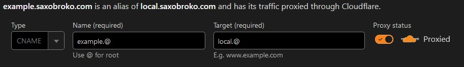

Cloudflare is the service I use for pretty much everything on the outside of the home network. It is the registrar for the domain saxobroko.com, and enables outside access of my networks services.

##How to login
1. Enter account details
2. It should come up with a 2FA prompt it'll use the [Yubikey](yubikey.md)
3. Now you're logged in

##How to add a local website
1. Follow the steps in [NPM](npm.md#how-to-add-a-new-site)
2. Click "Websites" on the sidebar
3. Click "saxobroko.com"
4. On the sidebar click "DNS"
5. Click "Add Record"
6. For type use "CNAME"
7. Name will be the address you intend to use (E.g EXAMPLE.@)
8. For the target use local.@

9. Click save, and then technically you're done. However I have additional steps.
10. Go to "Rules" on the sidebar and click "Configuration Rules"
11. Click "localnet full strict ssl"
12. Scroll to "Expression Preview" and click edit
13. paste " or (http.host eq "EXAMPLE.saxobroko.com")" to the end
	- replace EXAMPLE
14. Click save
15. On the sidebar click "Security" and "WAF"
16. Click "Custom rules"
17. Open "block no aus" 
	- This prevents access from outside of Australia
18. Scroll to "Expression Preview" and click edit
19. paste " or (http.host eq "EXAMPLE.saxobroko.com")" to the end
	- replace EXAMPLE
20. Click save, and now you're done :)