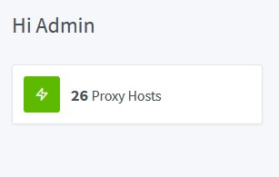
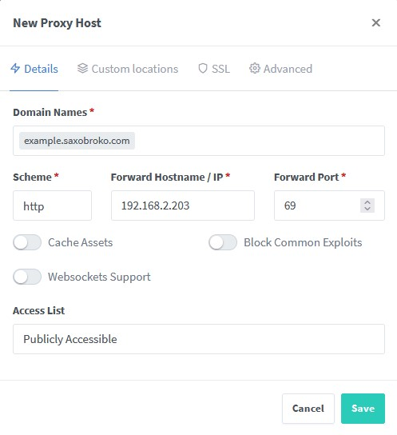

NGINX Proxy Manager is the reason you can access this through docs.saxobroko.com instead of 192.168.2.203:8069, that's the actual link btw

The only page you need to worry about is Proxy Hosts

##How to login
1. Access [this](http://192.168.1.200:6081/) link
    - Please note this link is only accessible from within the home network
2. Login using my email and password

##How to add a new site
1. Open the proxy hosts page
2. Click on "Add Proxy Host"
3. Enter the information for the service you'd like to add (You can use the image below for assistance)
    - Depending on the service you should enable "Block Common Exploits" and "Websockets Support"
	- example.saxobroko.com can be anything .saxobroko.com
4. You may notice that example.saxobroko.com is not yet accessible. This is because we have to set up the outside world to access it. We can do this through [Cloudflare](cloudflare.md#how-to-add-a-local-website)
	

