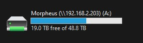

#How to Add Media
##Finding a source
Finding a souce might be the hardest part of this whole process. Personally I use a website called Aither. Anyway you need a source, the rest of this doc will just tell you how to add it to the Server for [Jellyfin](jellyfin.md)

##Adding to Server
Once you have your media file, it's pretty easy to add it to the Server

1. First you need to open "File Explorer" on my PC
2. Open "Morpheus"  

3. Open "Media" 
4. Depending on what you're trying to add either click on "Shows" or "Movies"
	- If adding a show make a folder called "Showname (Season1 Release Year)" and make a new folder for every season within that
	- If adding a movie make a folder called "Moviename (ReleaseYear)"
5. Make the folder and put the file(s) in it