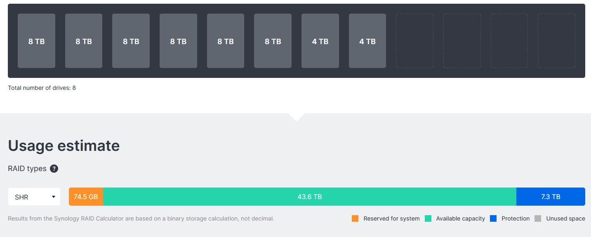

##Server Hardware
###Prebuilt vs Custom
I decided to go with a prebuilt NAS instead of custom built for 3 reasons.

  1. Stability
  2. Exclusive Apps
  3. Energy efficency
	
A custom built would've had a few benefits such as

  - Infinite upgradeability
  - Choice of OS
  - More customisation
  - Better to follow server tutorials
	
###Hardware
I chose a Synology 920+, because at the time I didn't know how I was going to use it, and it had room for upgrades. Looking back I would've gotten the version with 8 drives instead of 4, however I did end up upgrading it with 5 more through the expansion unit DX517. I have 9 drives 6 of which are 8 TB and 2 are 4 TB. I also have 2 NVME cache accelerators.

As I wrote this I was thinking it might be time for an upgrade to like DS1823xs+ ($3831) or DS1821+ ($1625.07). After looking at these prices it's clear which one i'm going to go for :face_with_peeking_eye:

##Photos
###Drive Use

###Synology DS920+

###Synology DX517

